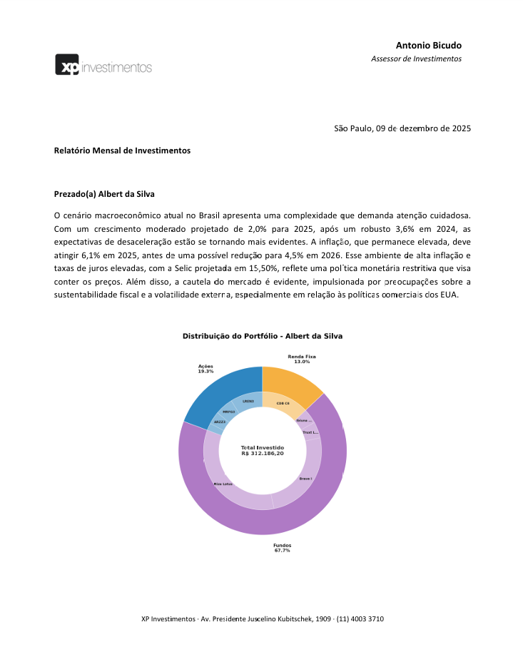

# investment Advice Agent

This product is an automated investment letter generation system powered by Large Language Models (LLMs).  
It transforms structured financial inputs—such as client portfolio data, risk profiles, and macroeconomic analyses—into coherent, professional investment letters suitable for client-facing communication.

The system is designed as a multi-step AI workflow, where each input is first summarized independently and then combined into a final narrative. This approach improves consistency, traceability, and overall output quality compared to single-prompt generation.

From an engineering perspective, the product emphasizes modularity, prompt versioning, and configuration-driven design, making it easy to adapt models, prompts, or inputs without changing core business logic.

This solution is applicable to wealth management teams, investment advisors, and financial institutions seeking to scale personalized client communication while maintaining quality, tone, and alignment with investment strategy.


## Overview

The workflow ingests structured financial inputs (portfolio data, risk profile, and macroeconomic analysis), generates intermediate AI summaries, and produces a final investment letter in Portuguese suitable for client communication.

The project emphasizes:
- Prompt engineering
- Modular orchestration
- Reproducibility
- Production-ready design principles

## Project Structure

```
investment-advice-agent/
├── main.py # Workflow orchestration
├── config/
│ ├── init.py
│ └── settings.py # Centralized configuration
├── src/
│ ├── init.py
│ ├── file_utils.py # File I/O utilities
│ ├── portfolio_parser.py # Reading and interpretation of the client’s portfolio.
│ └── ai_service.py # OpenAI integration layer
├── prompts/
│ ├── init.py
│ └── prompts.py # Prompt templates
├── Input/
│ ├── XP - Albert_s portfolio.txt
│ ├── XP - Albert_s risk profile.txt
│ └── XP - Macro analysis.txt
├── Output/
│ ├── output_letter.docx
│ └── output_letter.txt
├── requirements.txt
├── .env # Environment variables (ignored)
└── .gitignore
```

## How to Run

### 1. Install dependencies
```bash
pip install -r requirements.txt
```

### 2. Set environment variables

Create a .env file at the project root:

```
OPENAI_API_KEY=your_api_key_here
```

### 3. Execute the workflow

```bash
python main.py
```

The generated investment letter will be saved to:

```bash
Output/output_letter.docx
```

## 📋 Workflow Description

1. **Input ingestion:**
   - Client portfolio
   - Risk profile
   - Macroeconomic analysis

2. **LLM-based summarization:**
   - Portfolio performance summary
   - Risk profile interpretation
   - Macroeconomic outlook synthesis

3. **Investment letter generation:**
   - Combines the three summaries into a coherent, professional narrative

4. **Output persistence:**
   - Final letter is written to disk

📄 Example Output

Below is an excerpt of a generated investment letter:



*The screenshot above shows a real execution of the workflow using sample inputs.*

## Architecture

### `main.py`
Responsible exclusively for workflow orchestration.
No business logic is embedded at this level.

### `config/settings.py`
Central configuration hub:
- OpenAI model and generation parameters
- File paths
- Environment variable loading

### `src/file_utils.py`
File handling abstraction:
- `read_file()`
- `write_file()`

### `src/ai_service.py`
Encapsulates all OpenAI interactions:
- `call_openai()`: Generic LLM calls
- `summarize_portfolio_results()`: Portfolio summary
- `summarize_risk_profile()`: Risk profile summary
- `summarize_macroeconomic_outlook()`: Macroeconomic outlook summary
- `generate_investment_letter()`: Final investment letter generation

### `prompts/prompts.py`
Prompt templates organized into functions:
- `get_portfolio_prompt()`: Portfolio summary prompt
- `get_risk_profile_prompt()`: Risk profile prompt
- `get_macro_outlook_prompt()`: Macroeconomic analysis prompt
- `get_investment_letter_prompt()`: Final investment letter prompt

## Design Decisions

- **Separation of concerns:** Orchestration, I/O, prompt engineering, and AI logic are isolated.
- **Prompt centralization:** Prompts are treated as first-class artifacts.
- **Configuration isolation:** Model and generation parameters can be changed without touching business logic.
- **Extensibility**: New steps or models can be added with minimal refactoring.

## Configuration

Editable in `config/settings.py`:

- **Modelo:** `gpt-4o-mini`
- **Temperature:** `0.5`
- **Max Tokens:** `1024`

## Security Considerations

- API keys are stored in .env and excluded from version control
- No credentials are hardcoded
- Designed to be safely shared as a public repository

## Why This Project Matters

This project demonstrates:
- Practical application of LLMs in a real financial communication workflow
- Prompt engineering for multi-step reasoning pipelines
- Clean, maintainable Python architecture
- Production-oriented thinking (security, configurability, scalability)

## Possible Extensions

- Add unit tests for AI and file services
- Support multiple output languages
- Persist intermediate summaries for auditability
- Expose the workflow via API or web interface
- Add structured output validation (schemas)

## Requirements

- Python 3.7+
- OpenAI API key
- Input files located in the `Input/` directory

## Troubleshooting

### Error: "API key not found"
- Check if the `.env` file exists at the project root
- Confirm that the API key is correct and complete
- Ensure there are no extra spaces in the file

### Error: "File not found"
- Verify that the input files exist in the `Input/` directory
- Confirm file names (case-sensitive)

### Error: "Module not found"
- Ensure all dependencies are installed: `pip install -r requirements.txt`
- Make sure you are running the script from the project root

